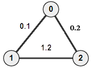
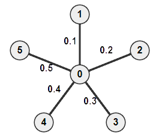
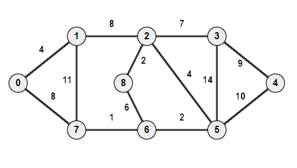

# Project 4 Test Cases
## basic.in
Tests a series of inserts, modifications, and deletions from a graph with 3 vertices. 
`3-17`   Insert edge between vertex 0 and vertex 1. 
`18-32`  Insert the same element (nothing should change). 
`33-47`  Insert edge between vertex 0 and vertex 2. 
`48-62`  Insert edge between vertex 1 and vertex 2. 
`63-77`  Modify edge between vertex 0 and vertex 2. 
`78-92`  Remove edge between vertex 0 and vertex 1. 
`93-107` Remove edge between vertex 0 and vertex 2. 
`108-122`Remove edge between vertex 1 and vertex 2.  

## constructor.in
Tests the state of the graph after being initialized (no inserts). 
`2`		There should not be any edges in the graph. 
`3-5`  	Degree for all 3 vertices should be 0. 
`6-8`  	If the vertices are equal, adjacent should return 0. 
`9-14` 	For nonadjacent vertices, adjacent should return infinity. 
`15-17`	The vertices are not connected, mst should return 0. 

## list.in
More of a test for adjacency lists. 
`6`		Modify an element at the head of the adjacency list. 
`7`		Modify an element in the middle of the adjacency list. 
`9`		Modify an element at the tail of the adjacency list. 

`28`	Erase an element at the head of the adjacency list. 
`29`	Erase an element in the middle of the adjacency list. 
`30`	Erase an element at the tail of the adjacency list. 

## invalid.in
Tests that exceptions are thrown when the input is invalid. 
`2-17`	Out of bounds vertex should throw an exception. 
`18-21`	Inserting an edge between the same vertex should throw an exception. 
`22-23`	Inserting a negative weight should throw an expection. 

## mst.in
Tests the example Ladan showed us in class. 
